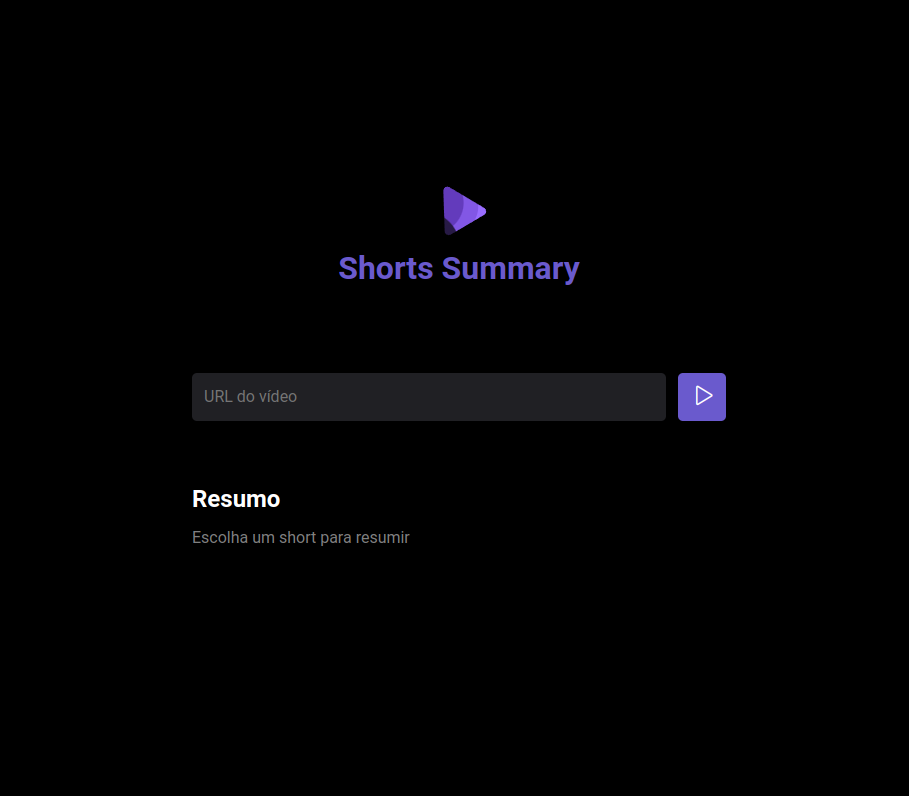

<h1 style= "color:slateBlue"> Shorts Summary 📱</h1>

<h2 style= "color:slateBlue">Sobre o projeto ✨<h2>
   

    O Shorts Summary é um programa que consiste em fazer resumos dos Shorts do YouTube. Ele utiliza um modelo de inteligência artificial para extrair o áudio e outra para resumir o conteúdo do video.
   

<h2 style= "color:slateBlue">Apresentação 👀 ✨<h2>

  

<h2 style= "color:slateBlue">Como acessar o projeto? 🤔<h2>
   
   Basta clicar [AQUI](https://shorts-summary-three.vercel.app/) que     você será direcionado!
   

<h2 style= "color:slateBlue"> Tecnologias utilizadas Front-end 💻 <h2>
    <ul>
       <li>HTML</li>
      <li>CSS</li>
      <li>JavaScript</li>
    </ul>

<h2  style= "color:slateBlue"> Tecnologias utilizadas Back-end  💻 <h2>
    <ul>
       <li>Node.js</li>
       <li>IA</li>  
    </ul>

<h2 style= "color:slateBlue"> Inspiração 💡<h2>

   

    Projeto feito a partir da NLW IA | ROCKETSEAT 💜
   

<h2 style= "color:slateBlue">Autor 👩🏻<h2>

Ana Luiza de Melo Soares.  
https://www.linkedin.com/in/ana-luiza-melo-8b94181b3/
   